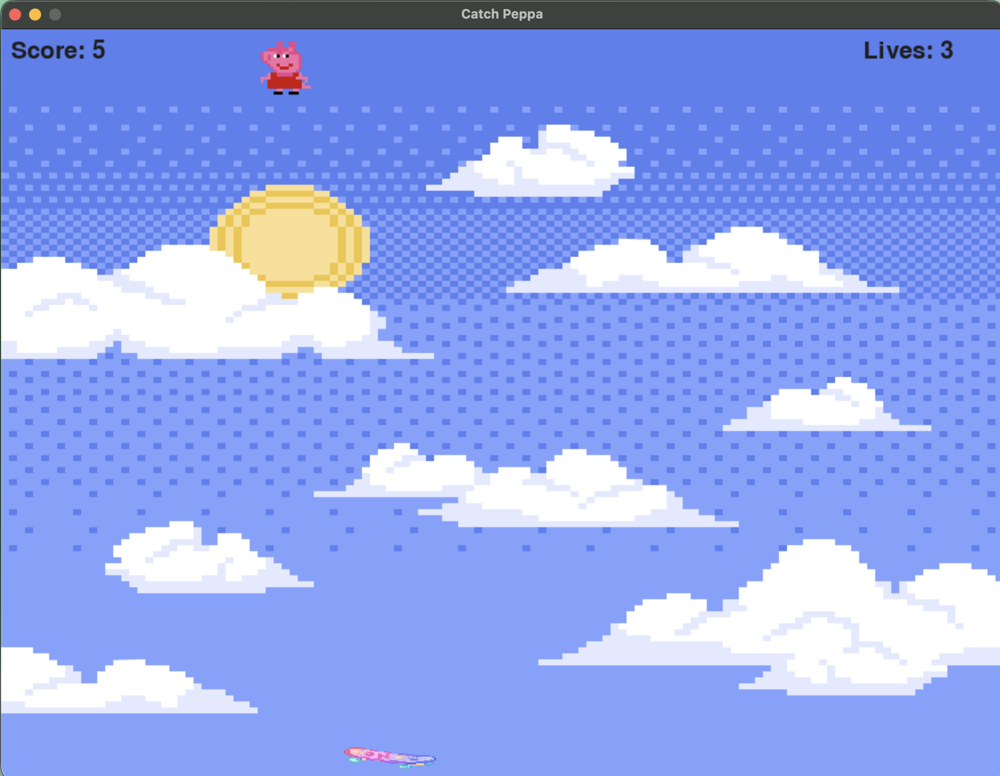

# peppa-pig-game
Catch Peppa is a fun and simple 2D arcade-style game built using Python and Pygame. In this game, Peppa falls from the top of the screen and the player controls a skateboard to catch them before they hit the ground!

🛠️ Built With
	•	Python 3
	•	Pygame
	•	Custom sound effects (catch, miss, game over)
	•	Background music with volume control
	•	Image-based sprites (peppa pig, skateboard, sky background)

  🚀 How to Run
	1.	Make sure Python is installed.
	2.	Install pygame:
  pip install pygame
  python3 appfall.py

  
